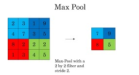

## Convolutional filters

* Finding the edges in the images by apllying filters which can detect straight edges, curves etc across RGB channels.

## Max Pooling

* Also called the down-sampling layer.
* Reducing dimensionality and allowing for assumptions to be made about features

## ReLU
> Rectified Linear Units

* An activation function f(x) = Max(0, x) which can be used by neurons
* activation function is used to determine the output of neural network like yes or no. It maps the resulting values in between 0 to 1  or 1 to -1 etc.
* Is used instead of logistic function to set negative values (gradient) to 0.
